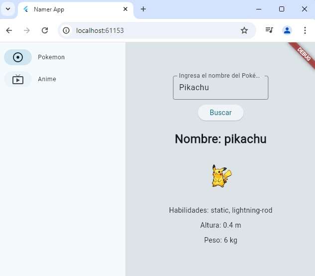
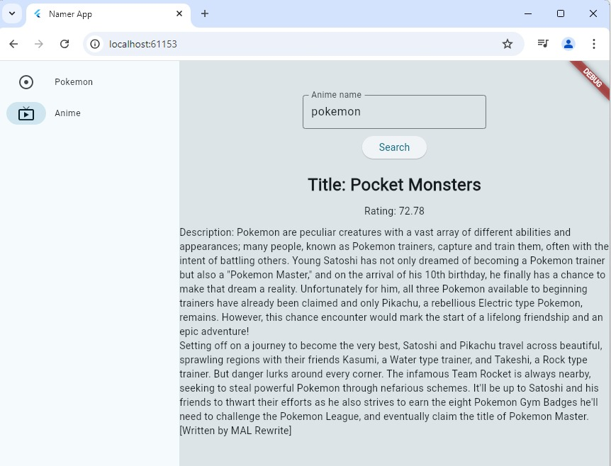

# Trabajo en clase

## Integrantes

#### Isaac León
#### Sebastian Coronado
#### Kevin Coloma

Se utilizo el API de pokemon para poder realizar la búsqueda de uno en específico

Para realizar la segunda aplicación se uso la Kitsu API donde podemos encontrar información acerca de animes

## Capturas de pantalla

